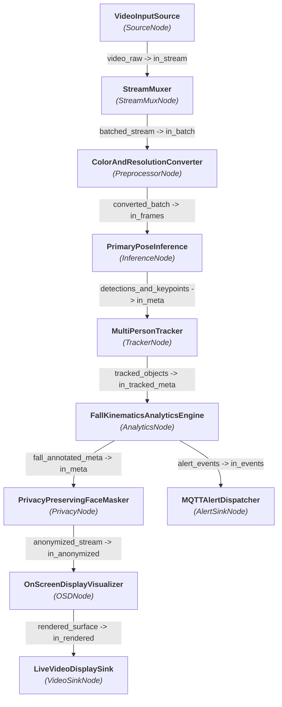

# PipeGen Pipeline IR Flow Graph

```mermaid
graph TD
    %% PipeGen Pipeline IR DAG
    source_0["<b>VideoInputSource</b><br/><i>(SourceNode)</i>"]
    mux_0["<b>StreamMuxer</b><br/><i>(StreamMuxNode)</i>"]
    preproc_0["<b>ColorAndResolutionConverter</b><br/><i>(PreprocessorNode)</i>"]
    pgie_pose_0["<b>PrimaryPoseInference</b><br/><i>(InferenceNode)</i>"]
    tracker_0["<b>MultiPersonTracker</b><br/><i>(TrackerNode)</i>"]
    fall_analytics_0["<b>FallKinematicsAnalyticsEngine</b><br/><i>(AnalyticsNode)</i>"]
    privacy_filter_0["<b>PrivacyPreservingFaceMasker</b><br/><i>(PrivacyNode)</i>"]
    osd_0["<b>OnScreenDisplayVisualizer</b><br/><i>(OSDNode)</i>"]
    sink_display_0["<b>LiveVideoDisplaySink</b><br/><i>(VideoSinkNode)</i>"]
    sink_mqtt_0["<b>MQTTAlertDispatcher</b><br/><i>(AlertSinkNode)</i>"]
    source_0 -->|"video_raw -> in_stream"| mux_0
    mux_0 -->|"batched_stream -> in_batch"| preproc_0
    preproc_0 -->|"converted_batch -> in_frames"| pgie_pose_0
    pgie_pose_0 -->|"detections_and_keypoints -> in_meta"| tracker_0
    tracker_0 -->|"tracked_objects -> in_tracked_meta"| fall_analytics_0
    fall_analytics_0 -->|"fall_annotated_meta -> in_meta"| privacy_filter_0
    privacy_filter_0 -->|"anonymized_stream -> in_anonymized"| osd_0
    osd_0 -->|"rendered_surface -> in_rendered"| sink_display_0
    fall_analytics_0 -->|"alert_events -> in_events"| sink_mqtt_0
```
